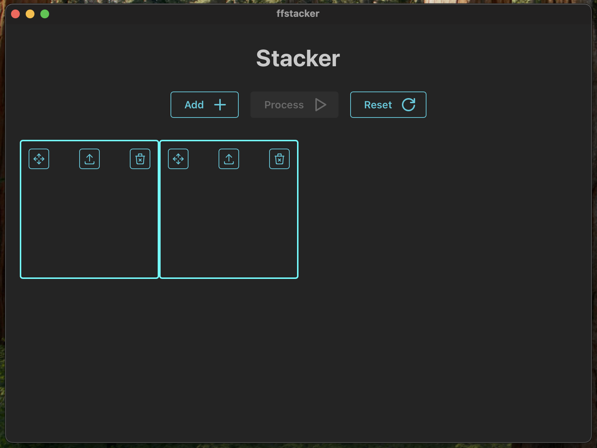

## FFstacker

An extremely overengineered and overcomplicated approach to wrapping ffmpeg's video stacking commands in a GUI (Tauri).

Why? Somewhat a learning project.

### Installation

Clone & [Tauri build](https://v1.tauri.app/v1/guides/building/)

